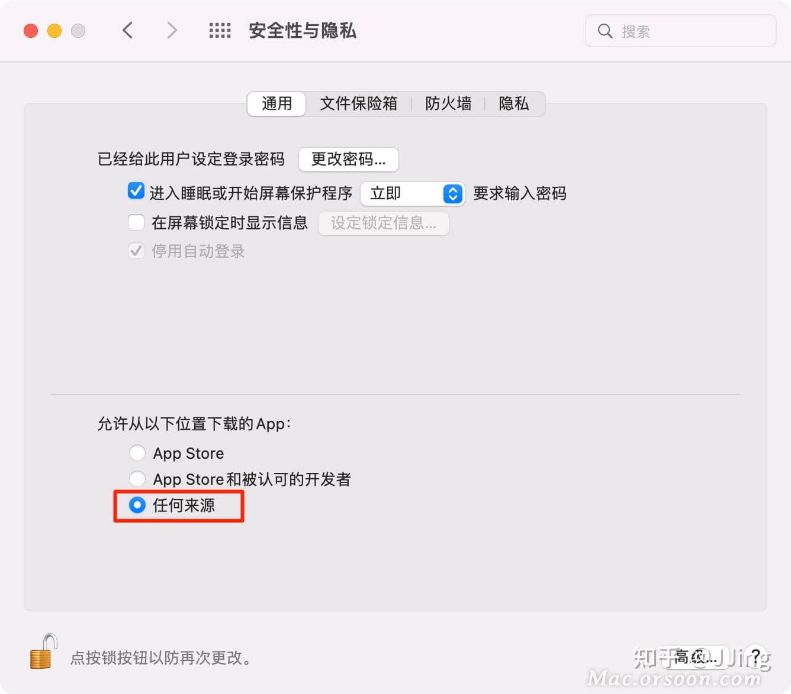

---
contributors:
  - 'ZhouYixun'
  - 'soniclei'
  - 'shinyvince'
  - 'mmagi'
---

# Agent 端部署

本文将介绍如何部署 Agent 端。

::: tip 注意
谨记一个主机只能部署一个 Agent 端，每个 Agent 的 Key 不能重复使用，多台设备可接入同一 Agent。

为了能正常使用，请保持与server版本一致。

考虑到远控时带宽消耗以及数据传输速度等场景，建议 Agent 优先使用有线网络环境而不是无线网络。
:::

## jar 方式部署

该方式将以本地 jar 包部署 Agent 端、Appium 等等环境。

1. **最低启动要求为JDK17**，可以前往 [这里](https://docs.aws.amazon.com/corretto/latest/corretto-17-ug/downloads-list.html) 安装下载。
2. 从部署好的前端界面【设备中心】的【Agent 中心】新增 Agent，记录 Agent 的 Key。
::: tip
从`v2.5.3`起，为降低用户部署成本，Agent在`plugins`文件夹下内置adb。

但是已知多个adb-server同时工作会出现抢占问题，因此如果你本地有其他adb-server正在工作，希望用自己已有的adb 或 版本低于v2.5.3时，需要加上这两步：
 1. 将安卓 SDK 设置到系统环境变量，命名为 ANDROID_HOME。打开 SDKManager，下载 **platform-tools**。确保 platform-tools 目录存在，adb 指令可用。
 2. 将 ANDROID_HOME、ANDROID_HOME/platform-tools 添加到系统 PATH 中。
::: 

3. 选择 **PC 对应的平台 zip** 下载并解压到任意目录（标记为 **工作目录** ，**如以下加速链接失效**，请自行前往 <a href="https://github.com/SonicCloudOrg/sonic-agent/releases" target="_blank">这里</a> 下载）

::: info Linux

👉 <a href="https://ghproxy.com/https://github.com/SonicCloudOrg/sonic-agent/releases/download/v2.6.0/sonic-agent-v2.6.0-linux_x86.zip" target="_blank">sonic-agent-v2.6.0-linux_x86.zip</a>

👉 <a href="https://ghproxy.com/https://github.com/SonicCloudOrg/sonic-agent/releases/download/v2.6.0/sonic-agent-v2.6.0-linux_x86_64.zip" target="_blank">sonic-agent-v2.6.0-linux_x86_64.zip</a>

👉 <a href="https://ghproxy.com/https://github.com/SonicCloudOrg/sonic-agent/releases/download/v2.6.0/sonic-agent-v2.6.0-linux_arm64.zip" target="_blank">sonic-agent-v2.6.0-linux_arm64.zip</a>

:::

::: info Macosx

👉 <a href="https://ghproxy.com/https://github.com/SonicCloudOrg/sonic-agent/releases/download/v2.6.0/sonic-agent-v2.6.0-macosx_x86_64.zip" target="_blank">sonic-agent-v2.6.0-macosx_x86_64.zip</a>

👉 <a href="https://ghproxy.com/https://github.com/SonicCloudOrg/sonic-agent/releases/download/v2.6.0/sonic-agent-v2.6.0-macosx_arm64.zip" target="_blank">sonic-agent-v2.6.0-macosx_arm64.zip</a>

:::

::: info Windows

👉 <a href="https://ghproxy.com/https://github.com/SonicCloudOrg/sonic-agent/releases/download/v2.6.0/sonic-agent-v2.6.0-windows_x86.zip" target="_blank">sonic-agent-v2.6.0-windows_x86.zip</a>

👉 <a href="https://ghproxy.com/https://github.com/SonicCloudOrg/sonic-agent/releases/download/v2.6.0/sonic-agent-v2.6.0-windows_x86_64.zip" target="_blank">sonic-agent-v2.6.0-windows_x86_64.zip</a>

:::

4. 赋予 **工作目录** 所有权限，然后确保解压后的 mini、config、plugins 文件夹与 jar 同级

```bash
$ sudo chmod -R 777 xxxxx
```

5. 修改 config 文件夹中 **application-sonic-agent.yml** 的配置信息，保存。
6. 在 **工作目录** 路径下执行以下指令。

::: tip
1. 如果你是 `Windows` 用户，请先在控制台输入 `chcp 65001` 并回车，再输入以下指令

此外，如需使用Python自定义脚本功能，还请 **再** 输入 `set PYTHONIOENCODING=UTF-8` 并回车，以避免Python脚本输出内容乱码

2. 如果你是 `Macosx` 用户，请查看下方常见问题Q1进行配置后再继续执行下方指令
:::

```bash
java -Dfile.encoding=utf-8 -jar sonic-agent-xxxx.jar
```

7. 部署完毕！可以前往设备接入文档（设备请竖直放置或平摊放置，左右旋转放置有可能影响坐标定位）。

## Docker 部署

::: danger 警告
Docker部署仅 Ubuntu 可用！仅 Ubuntu 可用！仅 Ubuntu 可用！

非Ubuntu系统请使用上方 **jar方式部署**！
:::

该方式将一次性部署 Agent 端以及所需环境。

准备工作：Docker，Sonic 前后端部署完毕

1. 从部署好的前端界面【设备中心】的【Agent 中心】新增 Agent，记录 Agent 的 Key。
2. [点击这里](https://ghproxy.com/https://github.com/SonicCloudOrg/sonic-agent/releases/download/v2.6.0/docker-compose.yml) 下载最新的docker-compose.yml，参考注释修改里面的内容。（如加速链接失效，请自行前往 <a href="https://github.com/SonicCloudOrg/sonic-agent/releases" target="_black">这里</a> 下载）
3. 执行以下指令（自行根据提示更改参数）。

```bash
docker-compose up -d
```
::: tip 如果您为中国大陆用户，出现访问DockerHub较慢的情况，可以从以下两点选择一个进行操作：
- 配置国内加速镜像源（推荐）
- <a href="https://ghproxy.com/https://github.com/SonicCloudOrg/sonic-agent/releases/download/v2.6.0/docker-compose-zh.yml" target="_blank">点击这里</a> 下载docker-compose-zh.yml后执行以下指令直接使用加速镜像（不推荐，加速源可能出现不稳定或网络波动，后续down的时候需要docker-compose -f docker-compose-zh.yml down）
```bash
docker-compose -f docker-compose-zh.yml up -d
```
:::
4. 部署完毕！可以前往设备接入文档。
5. (附) 如果您对Docker不熟悉，更推荐使用jar方式部署。

## 常见问题（Q&A）

Q1: Mac上部署有什么注意的吗？

A1: 需要信任Sonic的来源，不然部分插件无法正常启动。
1. 终端输入
```
sudo spctl --master-disable
```
2. 【安全性与隐私】将任何来源权限放开。


---

Q2: 明明配置好了 ANDROID_HOME，并且 adb 可用，为什么还是检测不到 ANDROID_HOME？

A2: 需要配置好 ANDROID_HOME 之后，PATH 里面也需要配置好。确认 `echo %ANDROID_HOME%` (win) 或 `echo $ANDROID_HOME` (mac 或 linux) 输出正确。

---

Q3: 查看日志发现与 Server 没有连上，该怎么解决？

A3: 主要分为多种情况:

1. Key 配置不正确，一个 Key 只能一个 Agent 使用。
2. 所有 ip 不能使用 localhost、127.0.0.1 之类的配置。

---

Q4: 查看日志发现时区不对，宿主机的时区没有问题，该怎么解决？

A4: 可以参考 [这个帖子](https://sonic-cloud.wiki/d/2297)

---

Q5: Mac上启动会有sonic-android-supply或其他插件安全弹窗？

A5: 建议还是按照上方Q1的解答解决最佳，除此之外可以这样解决 Mac：系统偏好设置 -> 安全性与隐私 -> 通用，点击信任或仍要打开。

---

::: tip
更多疑问可前往 👉[社区](https://sonic-cloud.wiki)👈 交流
:::
