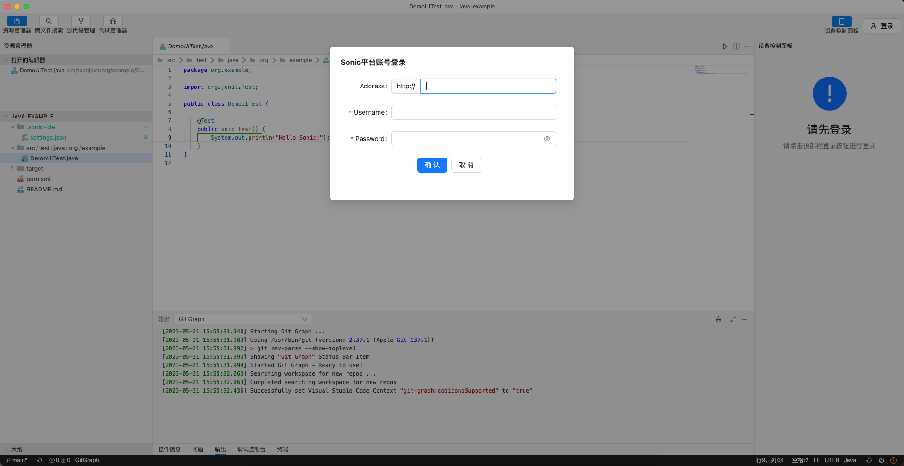
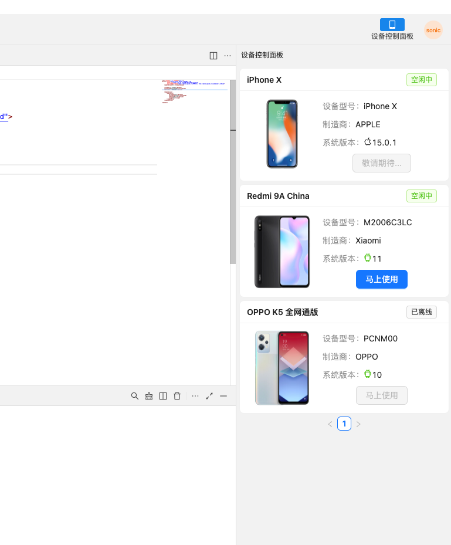
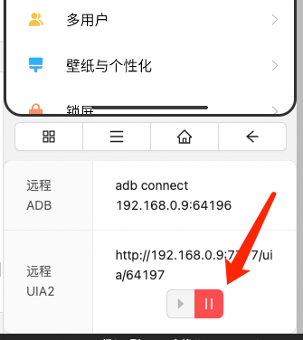

---
contributors:
- 'ZhouYixun'
---

# 基础教学
本文是IDE的基础教学。感谢您的观看

## 一、登陆至内部Sonic平台

1. 打开IDE后，点击右上方登录按钮



2. 填入相关信息

 | 字段名      | 描述信息                                                                             |
|----------|----------------------------------------------------------------------------------|
| Address  | 内部Sonic平台地址，填入部署时填入的 SONIC_SERVER_HOST:SONIC_SERVER_PORT 即可，例如: 192.168.1.1:3000 | 
| UserName | 登录用户名                                                                            | 
| Password | 登录密码                                                                             | 

3. 登录后即可看到设备列表



## 二、克隆官方例子仓库（可选）
::: tip 提示
这一步面向小白教学，如果你有丰富的编程经验，可以跳过这一步
:::

1. 前往 [sonic-uiautomation-example](https://github.com/SonicCloudOrg/sonic-uiautomation-example)，点击右上角fork到自己的仓库下。
2. 克隆fork后的仓库到本地
```shell
git clone https://github.com/你的用户名/sonic-uiautomation-example.git
```
3. 选择你的语言目录，以java为例
4. 打开IDE，选择当前项目目录，进入到`java-example`下
5. 选择一个设备进行远控
6. 将右侧adb远程地址与uia远程地址替换到example下的数据
```java
public class DemoUITest {
    // Test Data
    static AndroidDriver androidDriver;
    static String adbUrl = "192.168.0.9:49858";  //替换这里
    static String uiaUrl = "http://192.168.0.9:7777/uia/49860";  //替换这里
    static String appPackage = "com.android.settings";
```
7. 在IDE的终端执行
```shell
mvn test 
```
8. 恭喜，已经运行好Demo了！

## 三、后续脚本执行

### 关于远程adb地址和远程uia2地址的获取
我们在调试过程中，IDE可以很方便获取adb远程连接或者uia2远程连接地址，但是我们在脱离IDE运行脚本过程中，怎么去获取这两个地址呢？

可以调用Sonic的Rest API获取。可以查看 ➡️ [这里](https://sonic-cloud.cn/doc/doc-rest.html#%E9%80%9A%E8%BF%87rest-api%E5%8D%A0%E7%94%A8%E8%AE%BE%E5%A4%87%E5%B9%B6%E8%8E%B7%E5%8F%96%E8%BF%9C%E7%A8%8B%E8%B0%83%E8%AF%95%E4%BF%A1%E6%81%AF)

## 常见问题

Q1: 为什么我调用第三方框架（如STF、fastBot等）会启动不了服务？

A1: 因为会跟Sonic的UIAutomator2底层的instrument冲突，可以点击这里关闭服务。但是实时获取控件会暂时无法使用，可以点击旁边的启动按钮重新启动。后续脱离IDE运行脚本时，如果调用了HTTP远程占用设备接口，可以不填写uia2的端口，uia2的服务就不会启动。

